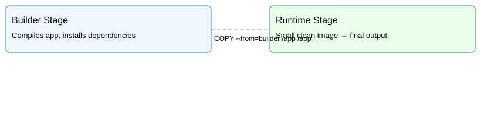

# 🚀 Day 6 — Docker Images & Dockerfiles (SRE-Level)

This module teaches how containers are built, optimized, secured, and deployed in production.

## 📚 Topics Covered

- Dockerfile fundamentals  
- Image layers & caching  
- Multi-stage builds  
- Alpine vs Debian base images  
- Security scanning (Trivy)  
- Image debugging & history  
- How production teams optimize images  
- Pushing secure images to Docker Hub

## 📁 Repository Structure

```
day6/
 ├── README.md
 ├── docs/
 │   ├── dockerfile-basics.md
 │   ├── dockerfile-best-practices.md
 │   ├── multi-stage-builds.md
 │   ├── image-layers.md
 │   ├── security-scanning.md
 │   └── caching-guide.md
 ├── examples/
 │   ├── python-app/
 │   │   ├── app.py
 │   │   └── Dockerfile
 │   ├── node-app/
 │   │   ├── server.js
 │   │   └── Dockerfile
 │   ├── alpine-vs-debian/
 │   │   ├── Dockerfile.alpine
 │   │   ├── Dockerfile.debian
 │   │   └── image-size-comparison.md
 │   └── multi-stage/
 │       ├── Dockerfile
 │       └── build-output.txt
 ├── labs/
 │   ├── lab1-build-basic-image.md
 │   ├── lab2-docker-layers.md
 │   ├── lab3-multi-stage.md
 │   ├── lab4-image-security.md
 │   ├── lab5-dockerfile-optimization.md
 │   └── lab6-dockerhub-push.md
 └── tools/
     ├── docker-build.md
     ├── docker-history.md
     ├── docker-inspect-image.md
     ├── trivy-scan.md
     └── dive-analysis.md

```

## 🎯 Learning Objectives

- ✔ Understand how images are constructed  
Layers, caching, base images, image formats (overlay2)
- ✔ Write production-ready Dockerfiles  
ENTRYPOINT vs CMD, RUN layering, build context optimization
- ✔ Optimize image size & build speed
Slim images, minimal layers, cache ordering  
- ✔ Implement Multi-Stage Builds
Separate build + run stages for clean lightweight images 
- ✔ Improve container security
Scanning for vulnerabilities
Running non-root
Reducing attack surface  

---

## 📘 Documentation Included

Each doc in day6/docs/ is a mini-chapter:

| File                             | Description                               |
| -------------------------------- | ----------------------------------------- |
| **dockerfile-basics.md**         | All Dockerfile instructions explained     |
| **dockerfile-best-practices.md** | Enterprise-grade production practices     |
| **multi-stage-builds.md**        | Full multi-stage build walkthrough        |
| **image-layers.md**              | Understanding overlay layers & caching    |
| **security-scanning.md**         | Trivy scanning & vulnerability management |
| **caching-guide.md**             | Cache optimization for CI/CD speed        |


---

## 🧪 Hands-on Labs

- Build your first image  
- Analyze Docker layers  
- Multi-stage build for Python  
- Scan images for CVEs  
- Optimize image size  
- Push image to Docker Hub

---

## 🧪 Labs Included (Hands-On)

| Lab                                 | Description                          |
| ----------------------------------- | ------------------------------------ |
| **lab1-build-basic-image.md**       | Build your first container image     |
| **lab2-docker-layers.md**           | Inspect and understand Docker layers |
| **lab3-multi-stage.md**             | Build small production-ready images  |
| **lab4-image-security.md**          | Scan for CVEs using Trivy            |
| **lab5-dockerfile-optimization.md** | Reduce image size by 40%             |
| **lab6-dockerhub-push.md**          | Tag & push images to Docker Hub      |

Each lab is written step-by-step with commands, explanations, and expected outcomes.

---


## 🛠 Tools Included

Tools in day6/tools/ include:

- docker-build.md – full build command reference
- docker-history.md – understand image layers
- docker-inspect-image.md – metadata, entrypoints, env
- trivy-scan.md – vulnerability scanning
- dive-analysis.md – deep layer analysis

---

## 📚 Example Projects Provided

✔ Python App Container

Simple "Hello from Python" container with Dockerfile.

✔ Node.js App Container

Minimal HTTP server inside Node.

✔ Alpine vs Debian comparison

Shows real production trade-offs.

✔ Multi-Stage Build Example

Professional production example used in real microservices.

---

## 🔍 Visual: Multi-Stage Build Diagram

Below is the visual representation stored in `day6/assets/multi-stage.svg`:




